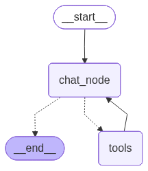

# LangGraph Chatbot

A simple conversational chatbot built with [LangGraph](https://langchain-ai.github.io/langgraph/) and [Streamlit](https://streamlit.io/). It streams responses from an OpenAI model and persists chat history across sessions using a SQLite-backed checkpointer, so previous conversation threads can be reopened from the sidebar.

## How it works

- `src/graph/` builds the LangGraph agent: `workflow.py` assembles the `StateGraph` (a `chat_node` wired to a `ToolNode`) and compiles it with a checkpointer; `router.py` holds the conditional-edge routing. Each conversation is a `thread_id`. The checkpointer is `AsyncSqliteSaver` locally (persisted to `chatbot.db`) and `InMemorySaver` on Render — see `CHECKPOINTER` below.
- `src/tools/` holds one tool per file (web search, stock price, PDF ingest/search) plus `mcp.py`; `get_all_tools()` merges the local tools with the remote MCP tools.
- `src/api/` is a FastAPI layer (HTTP routing + SSE streaming) over the same graph.
- `src/standalone/` is the in-process path: `streamlit_frontend.py` (chat UI) talking to `langgraph_backend.py` (async loop + sync bridges) without going over HTTP.

## Setup

1. Create and activate a virtual environment:
   ```bash
   python -m venv venv
   source venv/bin/activate
   ```
2. Install dependencies:
   ```bash
   pip install -r requirements.txt
   ```
3. Configure environment variables:
   ```bash
   cp .env.sample .env
   ```
   Then edit `.env` and set your `OPENAI_API_KEY`.

## Running the app

There are two ways to run the UI. Both open a chatbot in the browser — use
**New Chat** in the sidebar to start a fresh thread, or click a past thread to
resume it.

### Option A — in-process (no API)

```bash
streamlit run src/standalone/streamlit_frontend.py
```

The Streamlit process imports the agent directly. Run it from the repo root so
`chatbot.db` and `.env` resolve. (The entry scripts add `src/` to `sys.path`
themselves, so no `PYTHONPATH` is needed.)

### Option B — API + HTTP frontend

Start the API, then the frontend (two processes):

```bash
python src/main.py                                   # FastAPI on :8000
streamlit run src/frontend/streamlit_frontend.py     # UI, talks to the API
```

The frontend only speaks HTTP to the API — set `API_BASE_URL` if the API isn't
on `http://127.0.0.1:8000`.

#### API endpoints

| Method | Path | Description |
| --- | --- | --- |
| `GET`  | `/health` | liveness check |
| `GET`  | `/threads` | list conversation thread IDs |
| `GET`  | `/threads/{thread_id}/messages` | conversation history |
| `POST` | `/chat/stream` | `{thread_id, message}` → Server-Sent Events (`token`, `tool`, `error`, `done`) |

(`uvicorn api.app:app --app-dir src --reload` also works for the API.)

## Deploying to Render

`render.yaml` is a Blueprint that deploys **two web services**:

| Service | What it runs | Public? |
| --- | --- | --- |
| `langgraph-chatbot-api` | `uvicorn api.app:app` — the agent behind HTTP | yes (`/health`, `/chat/stream`, …) |
| `langgraph-chatbot-ui` | `streamlit run src/frontend/streamlit_frontend.py` — the chat UI | yes (this is what you open in a browser) |

The UI's `API_BASE_URL` is wired automatically from the API service's hostname
(`fromService`), and `frontend/settings.py` prepends `https://`.

1. Push this repo to GitHub.
2. In Render, click **New > Blueprint** and select the repo — it picks up `render.yaml` (both services).
3. When prompted, set the `sync: false` env vars on **the API service**: `OPENAI_API_KEY` (required) and `ALPHAVANTAGE_API_KEY` (for the stock tool).
4. Deploy. Both services build with `pip install -r requirements.txt`.

> If you had an earlier single-service deploy named `langgraph-chatbot`, delete it —
> the Blueprint now creates `-api` and `-ui`.

**Note on persistence (`CHECKPOINTER`):**

| Value | Behaviour |
| --- | --- |
| `sqlite` | Persist history to `CHECKPOINT_DB` (`chatbot.db`). Default when **not** on Render. |
| `memory` | Keep history only for the life of the process. Default on Render (set in `render.yaml`), since the free plan's disk is ephemeral anyway. |

Set `CHECKPOINTER` explicitly to override the default in either direction. For durable history on Render, use `sqlite` with a paid [persistent disk](https://render.com/docs/disks), or swap in `langgraph-checkpoint-postgres` with Render's managed Postgres.

## Project structure

```
.
├── src/
│   ├── main.py                # uvicorn entry point for the API
│   ├── config.py              # loads .env, exposes settings as constants
│   ├── standalone/            # run-directly, in-process path (no HTTP)
│   │   ├── __init__.py
│   │   ├── streamlit_frontend.py  # Streamlit chat UI (imports the agent)
│   │   └── langgraph_backend.py   # async loop + sync bridges it calls
│   ├── frontend/             # Streamlit chat UI that talks to the API over HTTP
│   │   ├── streamlit_frontend.py  # entry point — wires the pieces together
│   │   ├── settings.py            # API_BASE_URL + timeouts
│   │   ├── api_client.py          # HTTP calls + SSE parsing (no Streamlit)
│   │   ├── session_state.py       # st.session_state setup + mutators
│   │   └── components.py          # sidebar, history, streamed reply
│   ├── api/                   # FastAPI layer: HTTP routing + SSE streaming
│   │   ├── __init__.py
│   │   ├── app.py             # FastAPI app, routes, lifespan
│   │   ├── service.py         # async glue to the compiled graph
│   │   └── schemas.py         # request/response models
│   ├── graph/                 # agent graph assembly
│   │   ├── __init__.py
│   │   ├── workflow.py        # StateGraph build + compile; sqlite/memory checkpointer
│   │   └── router.py          # conditional-edge routing (route_after_chat)
│   ├── agents/                # graph nodes
│   │   ├── __init__.py
│   │   └── chat_node.py       # system prompt + make_chat_node()
│   ├── state/                 # graph state schemas (pure types)
│   │   ├── __init__.py
│   │   └── chat_state.py      # ChatState
│   └── tools/                 # one tool per file; LOCAL_TOOLS + get_all_tools()
│       ├── __init__.py
│       ├── web_search.py
│       ├── stock_price.py
│       ├── calculator.py
│       ├── pdf.py
│       └── mcp.py             # MultiServerMCPClient + load_mcp_tools()
├── requirements.txt          # Python dependencies
├── render.yaml               # Render Blueprint config
├── .env.sample               # Template for required environment variables
└── chatbot.db                # SQLite database storing conversation threads (gitignored)
```
